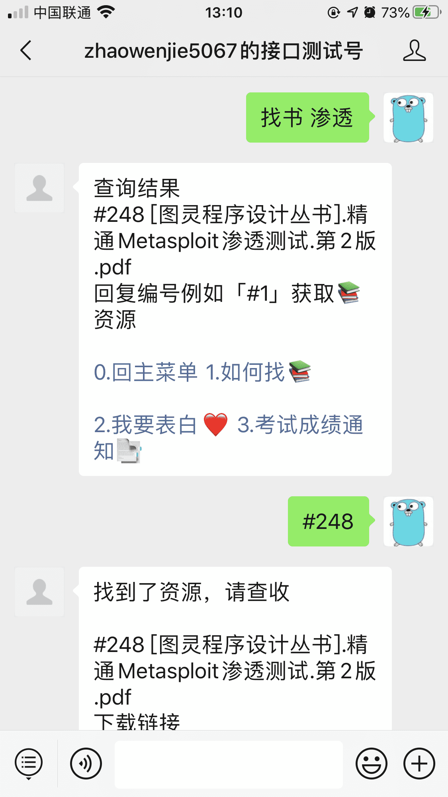
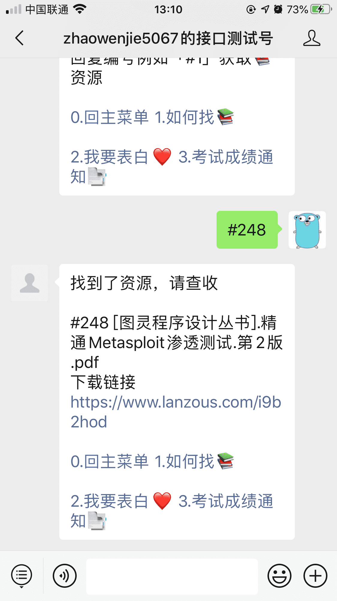

<p align="center"></p>

<p align="center">
</p>


## 关于Book Server

每年大家都在不停的寻找资料，不管是应对期末考试或者考研都是非常消耗时间的，然后就有了这个项目，该项目有以下特点。

- 使用方便RestAPI
- 使用BoltDB对搜索结果进行缓存，能够在短时间内抗住大量的相同请求。
- 使用MongoDB对文件进行储存。


## 使用Book Server

本项目由贝壳杂货铺开发使用，为北京科技大学提供校内图书搜索服务，主要为公众号，QQ机器人，TelegramBot等提供服务，不能提供HTML服务。

```bash
git clone https://github.com/dashjay/book_server
cd book_server
export GO111MODULE=on
export GOPROXY=https://goproxy.cn
go build main.go

#你需要一个.env
cp .env.example .env
./main

```

这个系统一共提供了两个服务


```bash
请求必须使用UrlEncode
curl localhost/get?input=找书 高等数学
curl localhost/get?input=#12
就可以获得#12号书籍
```

<div style="display: flex;">


</div>


## TODOLIST

- [ ] 使用悟空搜索引擎对中文进行分词，增加搜索匹配精度
- [ ] 提供用户自主上传接口，完成上传->存储->自动加入搜索引擎的流程


## Contributor

Dashjay

## License

The Server is open-sourced software licensed under the [MIT license](https://opensource.org/licenses/MIT).